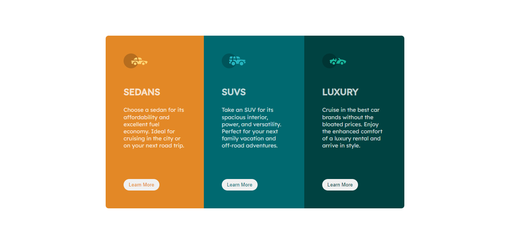

## Overview
> This is a three column card. it is an assignment from web3bridge, web2, team 1. The three column card is a work about different cars, types, sizes and uses. we got the work from frontend mentor challenge and I am very proud to say I did the work myself from scratch. Though I had a lot of challenges which google helped a lot with, except that... **I did the work.** 

## Challenges
> My challenge is to build the three column preview card and make it look at least very close to the work given in my design. The viewers of the challenge should:

- See the optimal layout depending on their device's screen size.
- See hover states for interactive elements.

## Screenshot

## My process
### Built with
- Sematic Html Markup
- Css properties
- Flexbox
- Media queries. Responsive webdesign
- ReadMe.md file
- Github

### What I learned
> This is a further study on the use of flexbox, giving sematic to my html, mastering css properties and pushing codes to my github. In addition I learnt:
1. Media Queries: this is making our work responsive not just to desktop but also on mobile phones.
2. ReadMe: I also learnt how to add a readme.me file to my project, that means that this is the first readme file i'm making.
> While working on this project, I figured out how to add an icon to a project.

### Difficulties
> I faced a lot of difficulties working on this project. Among which is:
- Adding my padding and margin: knowing the exert one to add at a particular area.
- Making my code responsive: making sure it shows exertly like it was giving in the mobile view.
- Sematic: making my html sematic so as not to make my code scattered and to help in my styling... and many more.

### Continued development
> I will pick up more projects from frontend mentor and keep practicing on things I already know and things I still see as a challenge. **I will keep practicing!!**

## Author
- Name: I am Abugu Angela Oluchi Victoria (Ria).
- Github: - [Angela-oluchi](https://github.com/Angela-Oluchi)
- Twitter: - [@AngelaRialuchi](https://twitter.com/AngelaRialuchi)

## Acknowledgment
> I really want to thank the whole team of web3bridge for their effort in making us learn software development most especially, my own Adetutu, I want to say a very big thank you. I dont think anyone can get a mentor like you. please, keep teaching us as we go higher. I love you guys...